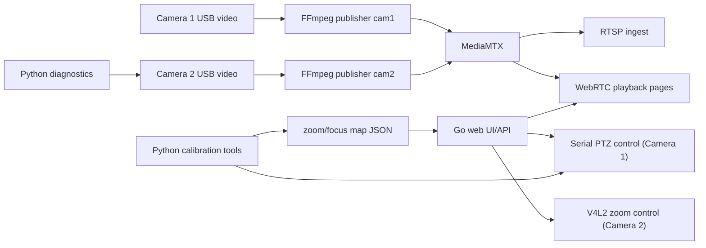

# Project Architecture Review

## 1. What this repository is

This repository is a mixed hardware-control and video-delivery project for a two-camera setup:

- Camera 1: `Kurokesu C3 4K + L085/L085D lens`, controlled through a serial PTZ/lens controller that accepts GRBL-like commands (`G90`, `G1`, `?`, `$HX`, `$HY`, `M114`, `M120`, `G92`).
- Camera 2: `NVECTECH PATRIOT 2 H50` / Rockchip UVC camera, controlled through Linux V4L2 controls (`v4l2-ctl`).
- Media transport: `FFmpeg -> RTSP -> MediaMTX -> WebRTC`.
- UI/API: small Go web servers.
- Calibration/tooling: many Python console tools for homing, calibration, diagnostics, and map authoring.

There are **two runtime stacks** in the repo:

1. `root stack` (`ptz-service`): the richer/older stack with camera control APIs, calibration-map playback, basic auth, and direct camera operation.
2. `new-app` (`new-app/app` + `new-app/ptz-init`): a cleaner/minimal baseline focused on reliable startup and simple monitoring.

The repo is not a clean monolith. It is a production-ish runtime plus an attached lab/tooling workspace.

## 2. Top-level layout

### Production/runtime files

- `main.go`, `handlers.go`, `ui.go`, `config.go`, `auth.go`
  Root Go HTTP service (`ptz-service`).
- `ptz.go`, `ptz_cam1_map.go`
  Camera 1 serial/PTZ control, homing flow, map playback.
- `cam2_zoom_v4l2.go`
  Camera 2 zoom control via `v4l2-ctl`.
- `docker-compose.yml`, `Dockerfile`, `mediamtx.yml`
  Root runtime topology.
- `scripts/cam1_publisher.sh`, `scripts/cam2_publisher.sh`
  FFmpeg publishers for RTSP ingest into MediaMTX.

### Minimal replacement stack

- `new-app/docker-compose.yml`
  Minimal compose topology.
- `new-app/app/main.go`
  Small monitoring-only web app.
- `new-app/ptz-init/ptz_init.py`
  One-shot startup homing/initialization container for Camera 1.
- `new-app/scripts/*.sh`
  Simplified publisher scripts.

### Calibration and operator tooling

- `ptz.py`
  Full interactive PTZ console for map-based Camera 1 operation.
- `camzoom.py`
  Minimal map-based stepper for Camera 1.
- `calibratorg.py`
  Main 25-point calibration console for building focus maps.
- `manual_map_builder.py`
  Manual editor for map JSON files.
- `h50_v4l2_zoom.py`
  Linux interactive zoom console for Camera 2.
- `uvc_zoom_probe.py`
  USB descriptor probe for checking whether standard UVC zoom exists.
- `cam2_diag.py`, `cam2_zoom_view.py`
  macOS/OpenCV diagnostics for Camera 2 formats, frame delivery, and zoom behavior.

### Legacy/one-off scripts

- `boot_init.py`, `goto_start.py`, `goto_start_raw.py`, `goto_pose.py`, `start_preset.py`
  Early serial motion helpers and preset scripts.
- `home_zoom_only.py`, `l085_init.py`, `l085_zoom.py`
  Narrow single-purpose lens experiments.
- `lens_calib_console.py`, `lens_calibrator.py`, `lens_zoom1_console.py`, `zoom25_calib.py`
  Older calibration consoles that predate the current `calibratorg.py` / `ptz.py` flow.
- `calibrate_fixed.py`, `calibrate_zoom.py`, `test_lens.py`
  Prototype scripts, closer to SDK/manual testing than to current runtime.

### Data / state

- `zoom25_focusmap.json`
  Main 25-point calibration map.
- `zoom8_focusmap.json`
  8-point reduced profile.
- `zoom_focus.json`
  Old/unused focus artifact.
- `ptz_state.json`
  Last interactive state for `ptz.py`.
- `cam2_diag_report*.json`
  Diagnostic dumps, mainly from macOS/OpenCV exploration.

## 3. Runtime architecture

### 3.1 Root stack (`ptz-service`)

Startup path:

1. `main.go` loads env/flags into `Config`.
2. `newPTZ(cfg)` opens the serial port and optionally loads a Camera 1 map.
3. `newCam2Zoom(cfg)` probes Camera 2 V4L2 controls.
4. HTTP routes are registered.
5. Basic Auth wraps the whole private mux.

HTTP surface:

- `/`
  HTML UI generated from `ui.go`.
- `/api/cam1/home`
  Run Camera 1 start flow and optionally go to map step 0.
- `/api/cam1/zoom`
  Either logical X-step motion or map-index motion.
- `/api/cam1/focus`
  Either logical Y-step motion or direct focus move in map mode.
- `/api/cam1/status`
  Serial controller status plus logical zoom/focus state.
- `/api/cam1/raw`
  Raw serial command pass-through when enabled.
- `/api/cam2/zoom`
  Camera 2 zoom set/delta through V4L2.
- `/api/cam2/zoom/status`
  Probe result of V4L2 zoom capability.
- `/cam1/rtc/*`, `/cam2/rtc/*`
  Reverse proxy hooks intended for MediaMTX WebRTC pages.

### 3.2 Minimal stack (`new-app`)

This stack intentionally separates responsibilities:

- `ptz-init`
  Runs the startup homing sequence once and exits.
- `cam1-publisher` / `cam2-publisher`
  Publish RTSP to MediaMTX.
- `web`
  Very small monitoring UI that only checks whether device nodes exist and builds WebRTC links.

This stack removes:

- serial control API from the UI,
- calibration-map playback,
- Camera 2 zoom API,
- basic auth,
- reverse proxy layer.

It keeps only startup initialization + video visibility.

## 4. Control plane

### 4.1 Camera 1 PTZ/lens control

Protocol characteristics:

- serial line, typically `/dev/ttyACM0`, `115200`.
- GRBL-like command model.
- status line format contains fields like `MPos`, `WPos`, `WCO`, `Pn`, `Bf`.

Main commands used:

- `G90`
  Absolute positioning mode.
- `G91`
  Relative positioning mode.
- `G1 X... Y... F...`
  Motion command.
- `?`
  Controller status.
- `$X`
  Unlock after alarm/reset.
- `$HX`
  Home zoom axis.
- `$HY`
  Home focus axis.
- `M120 P1`
  Limit LED on.
- `M114 P1`
  Iris open.
- `G92 X0 Y0`
  Set current point as logical zero.
- `Ctrl-X`
  Soft reset.

Start flow implemented in both Go and Python:

1. `RESET`
2. `UNLOCK ($X)`
3. `LIMIT LED ON`
4. `IRIS OPEN`
5. `HOME ZOOM ($HX)`
6. `HOME FOCUS ($HY)`
7. `BACKOFF`
8. `GOTO START`
9. `AUTO RELEASE LIMITS`
10. `G92 X0 Y0`

### 4.2 Camera 1 map playback

The map is a calibrated discrete zoom/focus profile:

- `zoomX[i]`
  Target X for zoom index `i`.
- `focusY[i]`
  Focus Y for the same zoom index.
- `meta.coord_space`
  `wpos` or `mpos`.
- `meta.x_preload`
  Preload offset to approach X from the same direction and reduce backlash.

In root Go service:

- zoom command chooses map index,
- X is approached with optional preload,
- Y is applied after X,
- current logical zoom becomes the selected index,
- map mode is blocked until the home flow has completed.

### 4.3 Camera 2 control

Camera 2 is not controlled over serial.
It is controlled through Linux V4L2 controls by shelling out to `v4l2-ctl`.

The code probes these controls in priority order:

1. `zoom_absolute`
2. `zoom_relative`
3. `zoom_continuous`

Supported modes:

- `absolute`
  Set exact zoom value or apply logical delta.
- `relative`
  Send pulse `+1` / `-1`.
- `continuous`
  Same pulse model as relative.

## 5. Media plane and codecs

### 5.1 Media flow

Common pattern in both stacks:

1. camera frame source is opened through V4L2,
2. FFmpeg publishes to `rtsp://mediamtx:8554/<stream>`,
3. MediaMTX exposes playback over WebRTC on `:8889`,
4. UI embeds/open the MediaMTX WebRTC page.

### 5.2 Camera 1 codecs/formats

Root stack publisher (`scripts/cam1_publisher.sh`):

- input options:
  - `mjpeg` from V4L2, default
  - `yuyv422` fallback
- output:
  - always encoded to `H.264` via `libx264`
  - pixel format normalized to `yuv420p`
  - `-tune zerolatency`
  - GOP forced with `-g` and `-keyint_min`
  - RTSP over TCP

Default root parameters:

- input: `1920x1080 @ 25fps`
- output bitrate: `10M`
- preset: `superfast`
- GOP: `15`

Minimal stack publisher (`new-app/scripts/cam1_publisher.sh`):

- input: `mjpeg`
- output: `H.264` / `libx264`
- adds more low-latency mux flags (`+genpts`, `pkt_size 1200`, `muxdelay 0.05`)

### 5.3 Camera 2 codecs/formats

Root stack publisher (`scripts/cam2_publisher.sh`) supports two input strategies:

- `h264` mode:
  - V4L2 input format `h264`
  - output codec `copy`
  - best path when the camera really exposes stable hardware H.264
- `mjpeg` mode:
  - V4L2 input format `mjpeg`
  - output encoded to `H.264` with `libx264`

Default root compose uses:

- `CAM2_MODE=mjpeg`
- input: `1024x768 @ 15fps`
- output: `H.264`
- bitrate: `4M`
- preset: `ultrafast`

So the current default production path for Camera 2 is:

`MJPEG over V4L2 -> FFmpeg transcode -> H.264 over RTSP -> MediaMTX WebRTC`

Minimal stack publisher (`new-app/scripts/cam2_publisher.sh`):

- only uses `mjpeg` input,
- always transcodes to `H.264`,
- no H.264 passthrough branch.

### 5.4 MediaMTX role

MediaMTX is used as:

- RTSP ingest endpoint,
- WebRTC playback endpoint,
- no complex transcoding logic is implemented inside MediaMTX config.

The checked-in `mediamtx.yml` is minimal:

- RTSP listen `:8554`
- paths `cam1`, `cam2`

Most runtime behavior is pushed through container envs in compose.

## 6. Calibration and diagnostics subsystem

### 6.1 Calibration authoring path

The intended calibration toolchain is:

1. `calibratorg.py`
   Build a 25-point map from actual hardware.
2. `manual_map_builder.py`
   Fix or hand-edit points if needed.
3. `ptz.py`
   Operate the calibrated lens interactively and persist runtime state.
4. `zoom25_focusmap.json` / `zoom8_focusmap.json`
   Feed the runtime service.

The Python tooling is richer than the Go service in one important way:

- it keeps `limitXY` metadata,
- it warns on non-monotonic points,
- it can refuse save operations on active endstops,
- it can interpolate missing focus values,
- it persists per-session state.

### 6.2 Camera 2 diagnostics

There are two separate diagnostic branches:

- Linux/V4L2:
  - `h50_v4l2_zoom.py`
  - `uvc_zoom_probe.py`
- macOS/OpenCV/AVFoundation:
  - `cam2_diag.py`
  - `cam2_zoom_view.py`

This indicates Camera 2 behavior was investigated both on the target Linux runtime and on a macOS workstation.

## 7. File-by-file runtime responsibility

### Root Go service

- `main.go`
  Startup, dependency construction, route registration.
- `config.go`
  Env/flag loading.
- `handlers.go`
  JSON API surface.
- `ptz.go`
  Low-level serial transport, retries, status queries.
- `ptz_cam1_map.go`
  Map parsing, homing flow, positional helpers, status parsing.
- `cam2_zoom_v4l2.go`
  Camera 2 V4L2 probing and control.
- `reverse_proxy.go`
  Prefix-based reverse proxy to MediaMTX.
- `proxy.go`
  Legacy-style MJPEG proxy helper; appears unused in the current root wiring.
- `ui.go`
  Embedded HTML/CSS/JS UI.
- `auth.go`
  Basic Auth wrapper.
- `http_helpers.go`
  JSON output and small helpers.

### New minimal stack

- `new-app/app/main.go`
  Simple monitoring web app.
- `new-app/app/main_test.go`
  Only request-host / URL-generation tests.
- `new-app/ptz-init/ptz_init.py`
  Camera 1 startup homing container.
- `new-app/scripts/*.sh`
  Simplified FFmpeg publishers.

## 8. Architecture observations

- The repo contains both runtime code and engineering notebooks/tooling in the same root.
- Python is the richer source of operational knowledge.
  The Go runtime is intentionally narrower and faster to deploy.
- `new-app` is not just another environment.
  It is an explicit simplification attempt.
- Camera 1 is stateful and calibration-driven.
- Camera 2 is stateless from the service point of view; it is treated mostly as a V4L2 device with optional zoom controls.
- The media architecture is clean and standard:
  FFmpeg handles device quirks, MediaMTX handles playback protocols, Go only handles control/UI.

## 9. Review findings

### Finding 1: root UI bypasses the configured reverse proxy path and hardcodes direct WebRTC access on port 8889

Relevant files:

- `main.go` registers `/cam1/rtc/` and `/cam2/rtc/` reverse proxies.
- `ui.go` rewrites playback URLs to `host:8889` directly.

Impact:

- the reverse proxy configuration is effectively dead for the browser path,
- playback bypasses the authenticated Go service,
- deployments behind a different public MediaMTX port or behind TLS termination will break more easily,
- the UI and the backend configuration disagree about the canonical playback path.

Evidence:

- reverse proxy registration in `main.go`
- direct URL construction in `ui.go`

### Finding 2: Camera 2 "online/offline" state is tied to zoom-control availability, not to actual stream availability

Relevant files:

- `handlers.go`
- `cam2_zoom_v4l2.go`
- `ui.go`

Impact:

- if `v4l2-ctl` cannot probe zoom controls, the UI marks Camera 2 as offline and blanks the iframe,
- this can hide a perfectly healthy video stream from a view-only operator,
- control-plane failure is being misreported as media-plane failure.

This is an architectural coupling bug between video presence and control capability.

### Finding 3: the Go runtime ignores `limitXY` safety metadata from calibration maps

Relevant files:

- `ptz_cam1_map.go`
- `zoom25_focusmap.json`
- Python calibration tools (`calibratorg.py`, `ptz.py`, `manual_map_builder.py`)

Impact:

- Python tooling preserves endstop flags and warns on unsafe points,
- Go loader only consumes `zoomX`, `focusY`, and part of `meta`,
- if a wider point range is enabled later or another map contains flagged points, the runtime has no guardrail and will replay them as normal positions.

Current default compose is partially protected because it uses only the first 8 points (`CAM1_MAP_STEPS=8`), but the mismatch still exists in the design.

### Finding 4: default deployment settings are weak from a security standpoint

Relevant files:

- `docker-compose.yml`

Impact:

- control UI defaults to `admin/admin`,
- MediaMTX WebRTC/RTSP ports are published directly,
- because the root UI uses direct `:8889` playback URLs, stream exposure is wider than the authenticated API surface suggests.

This is acceptable for a lab bench, but weak for any shared network.

## 10. Verification performed

- `go test ./...` in `/Users/codinec/cam`
  Passed build for root module (`ptz-service` has no Go tests).
- `go test ./...` in `/Users/codinec/cam/new-app/app`
  Passed.

## 11. Recommended next architectural cleanup

1. Pick one runtime as the canonical production stack.
2. Move all calibration/diagnostic Python tools into a dedicated `tools/` or `lab/` subtree.
3. Make playback URLs originate from server config, not browser-side hardcoding.
4. Separate stream health from zoom-control health.
5. Add schema validation for map files, including optional `limitXY` handling.
6. Replace default credentials and decide whether MediaMTX should be public, proxied, or internal-only.
